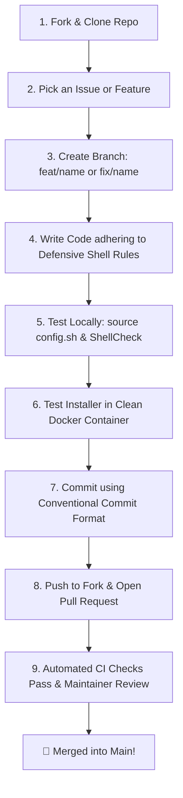

# 🤝 Contributing to fancybash

> **Welcome to the `fancybash` developer community!**  
> Whether you are a seasoned open-source contributor or submitting your very first Pull Request (PR), this guide will take you step-by-step through the entire contribution lifecycle.

<div align="center">

[](https://github.com/rihadjahanopu/fancybash/issues)
[](https://github.com/rihadjahanopu/fancybash/pulls)
[](LICENSE)

</div>

---

## 📌 Table of Contents

- [1. First-Time Contributor Roadmap](#1-first-time-contributor-roadmap)
- [2. Step-by-Step Developer Quickstart](#2-step-by-step-developer-quickstart)
  - [Step 1: Fork & Clone the Repository](#step-1-fork--clone-the-repository)
  - [Step 2: Understand the Project Architecture](#step-2-understand-the-project-architecture)
  - [Step 3: Create a Dedicated Feature Branch](#step-3-create-a-dedicated-feature-branch)
  - [Step 4: Write Clean, Defensive Code](#step-4-write-clean-defensive-code)
  - [Step 5: Test Locally & Validate Idempotency](#step-5-test-locally--validate-idempotency)
  - [Step 6: Commit Using Conventional Commits](#step-6-commit-using-conventional-commits)
  - [Step 7: Push & Open a Pull Request (PR)](#step-7-push--open-a-pull-request-pr)
- [3. Code Standards & Defensive Shell Rules](#3-code-standards--defensive-shell-rules)
- [4. Testing Cheat Sheet (Local, Docker & ShellCheck)](#4-testing-cheat-sheet-local-docker--shellcheck)
- [5. Conventional Commit Reference Matrix](#5-conventional-commit-reference-matrix)
- [6. Pull Request Review & Approval Checklist](#6-pull-request-review--approval-checklist)
- [7. Need Help or Have Questions?](#7-need-help-or-have-questions)

---

## 1. First-Time Contributor Roadmap

Here is the exact lifecycle of a contribution in `fancybash` from start to finish:



---

## 2. Step-by-Step Developer Quickstart

### Step 1: Fork & Clone the Repository

1. Click the **Fork** button at the top right of the [`rihadjahanopu/fancybash`](https://github.com/rihadjahanopu/fancybash) repository.
2. Clone your fork to your local system:

```bash
git clone https://github.com/YOUR_USERNAME/fancybash.git
cd fancybash
```

3. Add the upstream original repository to keep your fork updated:

```bash
git remote add upstream https://github.com/rihadjahanopu/fancybash.git
```

---

### Step 2: Understand the Project Architecture

Before modifying code, take 2 minutes to inspect these two core technical manuals:

* 📄 **[ARCHITECTURE.txt](ARCHITECTURE.txt)** — Explains repository layout, line banners, and section structure.
* 📄 **[DSA.md](DSA.md)** — Explains performance constraints ($O(1)$ prompt rule, subshell daemons, dynamic dependency injections).

#### Repository Layout Overview:
```
fancybash/
├── config.sh              ★ Core Bash environment (aliases, telemetry prompt, TUI modules)
├── config.zsh             ★ Zsh counterpart with Zsh-specific plugins
├── config.ps1             ★ PowerShell 7+ variant
├── install.sh             ★ Non-destructive installer script
├── web/                   ★ Static Netlify site (index.html, style.css, main.js)
├── zed/                   ★ Zed IDE installer scripts
└── .github/workflows/    ★ Automated GitHub Actions CI/CD pipelines
```

---

### Step 3: Create a Dedicated Feature Branch

Always create a new branch from `main` for your work. Never work directly on `main`:

```bash
# Sync with upstream main
git checkout main
git pull upstream main

# Create your feature or bugfix branch
git checkout -b feat/add-docker-logs-alias
# or for a bug fix:
git checkout -b fix/prompt-temp-sensor-alpine
```

---

### Step 4: Write Clean, Defensive Code

Modify `config.sh` (and `config.zsh` if applicable). Follow these mandatory rules:

#### 1. Scope Variables using `local`
Always declare function variables using `local` to avoid polluting global shell state:

```bash
# ✅ CORRECT
my_function() {
    local branch_name
    branch_name=$(git branch --show-current 2>/dev/null)
    echo "$branch_name"
}

# ❌ WRONG (Mutates global environment variable)
my_function() {
    branch_name=$(git branch --show-current)
}
```

#### 2. Check Tool Availability before Executing
Never assume a tool is installed. Fail silently or use `_fb_ensure_dep`:

```bash
# ✅ CORRECT
node_version() {
    command -v node >/dev/null 2>&1 || return 0
    echo "🟢 $(node -v)"
}

# ❌ WRONG (Prints error messages into prompt stream if node is missing)
node_version() {
    echo "🟢 $(node -v)"
}
```

#### 3. Quote All Variable Expansion
Prevent word splitting and wildcard expansion bugs by quoting variables:

```bash
# ✅ CORRECT
echo "$user_path"
[[ -d "$target_dir" ]]

# ❌ WRONG
echo $user_path
[ -d $target_dir ]
```

#### 4. Strict $O(1)$ Prompt Guard Rule
> [!IMPORTANT]
> **NEVER** place blocking network requests, synchronous HTTP `curl` calls, or unbounded disk searches (`find /`) inside functions called by the prompt (`PS1`). Prompt evaluation must finish in $< 2\text{ms}$.

---

### Step 5: Test Locally & Validate Idempotency

#### A. Reload & Test in Your Local Terminal
```bash
# Source modified config in your current shell session
source config.sh

# Run your new command or test modified behavior
my_new_alias
```

#### B. Run Static Linting with ShellCheck
Ensure your script passes static analysis without syntax errors:
```bash
shellcheck -s bash config.sh
shellcheck -s bash install.sh
```

#### C. Clean Docker Container Test (Recommended)
Test how your change performs in a completely clean environment:
```bash
docker run --rm -it ubuntu:latest bash -c "
  apt update -qq && apt install -y curl git &&
  bash <(curl -fsSL https://raw.githubusercontent.com/YOUR_USERNAME/fancybash/main/install.sh)
"
```

---

### Step 6: Commit Using Conventional Commits

We strictly follow the **Conventional Commit Specification**:

```bash
git add config.sh README.md
git commit -m "feat(docker): add dwatch function for container file monitoring"
```

#### Commit Structure:
```
type(scope): concise subject in imperative present tense (max 72 chars)

[Optional detailed body explaining WHY the change was made]
```

---

### Step 7: Push & Open a Pull Request (PR)

1. Push your branch to your GitHub fork:
```bash
git push -u origin feat/add-docker-logs-alias
```

2. Navigate to [`rihadjahanopu/fancybash`](https://github.com/rihadjahanopu/fancybash) on GitHub.
3. Click **Compare & Pull Request**.
4. Fill in the PR template with details of what was changed and why.

---

## 3. Code Standards & Naming Conventions

| Component Category | Naming Pattern | Example | Description |
| :--- | :--- | :--- | :--- |
| **Short Navigation Aliases** | 2–4 lower-case letters | `gs`, `gcm`, `nrd` | Fast productivity shortcuts |
| **Telemetry & Prompt Helpers** | `verb_noun` | `parse_git_branch`, `cpu_temp` | Silent functions used in `PS1` |
| **Docker Aliases / Functions** | `d` prefix | `dps`, `drm`, `dman` | Container management helpers |
| **Internal Engine Helpers** | `_fb_` prefix | `_fb_ensure_dep`, `_fb_sed_i` | Private project functions |
| **Interactive TUI Tools** | Short single word | `uup`, `uu`, `todo`, `ui` | Interactive user dashboards |

---

## 4. Testing Cheat Sheet (Local, Docker & ShellCheck)

```bash
# 1. Quick In-Shell Test
source config.sh

# 2. Syntax & Lint Validation
shellcheck -s bash config.sh
shellcheck -s bash install.sh

# 3. Idempotency Test (Installer must run twice cleanly without duplicate blocks)
bash install.sh && bash install.sh

# 4. Interactive Zsh Test
zsh -c "source config.zsh && rand_color"
```

---

## 5. Conventional Commit Reference Matrix

| Type | When to Use | Example Commit Message |
| :--- | :--- | :--- |
| `feat` | Adding a new alias, function, or prompt metric | `feat(git): add gwip shortcut for WIP commits` |
| `fix` | Resolving a bug or shell error | `fix(prompt): resolve syntax error on Alpine Linux` |
| `docs` | Documentation updates (README, Wiki, comments) | `docs(readme): update Docker command cheatsheet` |
| `style` | Code formatting, spacing, typo fixes | `style(config): normalize section header banners` |
| `refactor` | Code restructure without behavior change | `refactor(helpers): optimize meminfo parsing algorithm` |
| `chore` | CI/CD, workflows, build script maintenance | `chore(ci): update shellcheck GitHub Actions version` |

---

## 6. Pull Request Review & Approval Checklist

Before submitting your PR, check off this self-review list:

- [ ] My code follows the project's defensive shell rules (`local` variables, double quotes).
- [ ] Prompt functions operate in $O(1)$ time without network calls or slow operations.
- [ ] If I added a new user-facing alias or command, I updated `README.md` and `ARCHITECTURE.txt`.
- [ ] If I added a new command, I updated the inline cheatsheet in `keep()`.
- [ ] Code passes `shellcheck -s bash config.sh` without critical warnings.
- [ ] My commit messages follow the Conventional Commit format.

---

## 7. Need Help or Have Questions?

If you get stuck or have questions at any point:
* Open a discussion in [GitHub Discussions](https://github.com/rihadjahanopu/fancybash/discussions).
* Ask in an open [GitHub Issue](https://github.com/rihadjahanopu/fancybash/issues).
* Tag `@rihadjahanopu` in your PR for mentorship and code review!

<br>

<div align="center">

**Thank you for making `fancybash` awesome! Happy Coding! 🚀**  
*Made with ❤️ for developers worldwide · Released under the MIT License*

</div>
