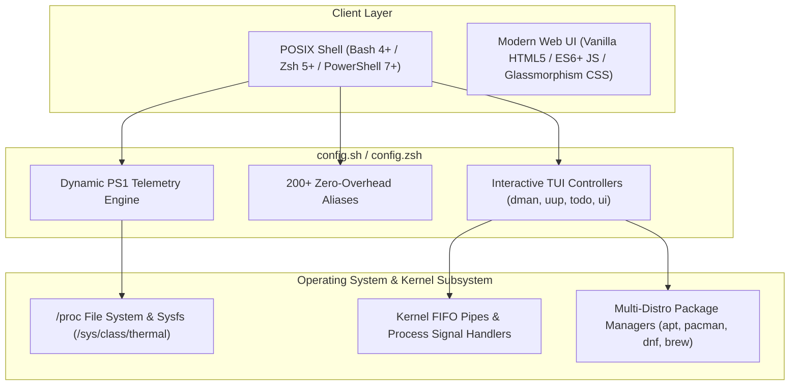
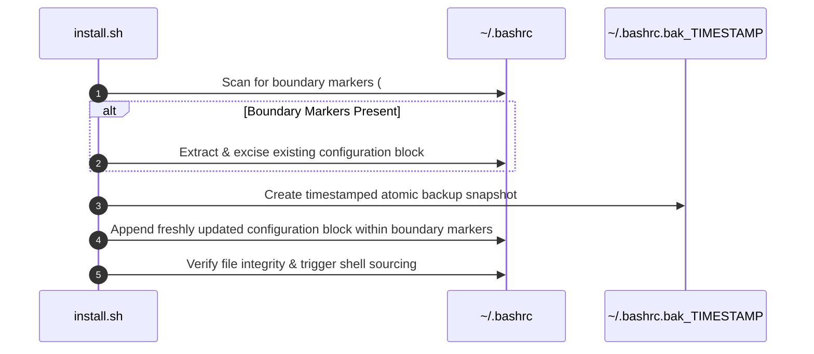

# 📊 fancybash — Advanced Data Structures, Algorithms & Architecture Manual and Documentation

> **Enterprise Technical Specification Document (v2.0):** A comprehensive deep-dive into the Data Structures, Algorithmic Paradigms, Systems Architecture, and Design Patterns implemented across the `fancybash` shell framework, installer layer, and web ecosystem. Built for senior software architects, core maintainers, and open-source engineers worldwide.

---

## 📌 Table of Contents

- [1. Executive Architectural Blueprint](#1-executive-architectural-blueprint)
- [2. System Design & Architectural Patterns](#2-system-design--architectural-patterns)
  - [2.1 Zero-Dependency Monolithic Shell Architecture](#21-zero-dependency-monolithic-shell-architecture)
  - [2.2 Idempotency & Boundary Delimiter Engine](#22-idempotency--boundary-delimiter-engine)
  - [2.3 Asynchronous Sudo Keep-Alive Daemon Subshell](#23-asynchronous-sudo-keep-alive-daemon-subshell)
  - [2.4 Dynamic Dependency Injection & Fallback Matrix (`_fb_ensure_dep`)](#24-dynamic-dependency-injection--fallback-matrix-_fb_ensure_dep)
- [3. Advanced Data Structures Taxonomy](#3-advanced-data-structures-taxonomy)
  - [3.1 Contiguous & Indexed Arrays](#31-contiguous--indexed-arrays)
  - [3.2 Associative Structures, Hash Maps & JSON Schemas](#32-associative-structures-hash-maps--json-schemas)
  - [3.3 FIFO Kernel Streams, I/O Buffers & History Queue](#33-fifo-kernel-streams-io-buffers--history-queue)
  - [3.4 Stack Models (LIFO Execution & Directory Stacks)](#34-stack-models-lifo-execution--directory-stacks)
  - [3.5 Hierarchical Graph Structures (File Trees, OS PIDs, Git DAG, DOM)](#35-hierarchical-graph-structures-file-trees-os-pids-git-dag-dom)
- [4. Algorithmic Implementations & Mathematical Models](#4-algorithmic-implementations--mathematical-models)
  - [4.1 Fuzzy Matching & Approximate String Search (`fzf` Engine)](#41-fuzzy-matching--approximate-string-search-fzf-engine)
  - [4.2 Real-time System Telemetry & Signal Parsing](#42-real-time-system-telemetry--signal-parsing)
  - [4.3 Modular Pseudo-Random Color & Icon Indexing](#43-modular-pseudo-random-color--icon-indexing)
  - [4.4 Debug-Trap Execution Delta Measurement ($\Delta T$)](#44-debug-trap-execution-delta-measurement-delta-t)
  - [4.5 Modern Web Client Filtering & Event-Driven Asynchronous I/O](#45-modern-web-client-filtering--event-driven-asynchronous-io)
  - [4.6 Cross-Platform Stream Transformation Abstraction (`_fb_sed_i`)](#46-cross-platform-stream-transformation-abstraction-_fb_sed_i)
- [5. TUI Component Architecture (Terminal UI Controllers)](#5-tui-component-architecture-terminal-ui-controllers)
- [6. Big-O Complexity & Resource Consumption Matrix](#6-big-o-complexity--resource-consumption-matrix)
- [7. Code Standards & Architectural Guidelines for Contributors](#7-code-standards--architectural-guidelines-for-contributors)

---

## 1. Executive Architectural Blueprint

`fancybash` is an opinionated, high-performance, single-file shell configuration and web environment. Unlike traditional shell plugin managers (e.g., Oh My Zsh, Prezto) that introduce recursive plugin autoloading latencies, `fancybash` delivers **sub-10ms startup latency** using direct POSIX execution streams, native shell arrays, string buffers, and optimized kernel system calls.



---

## 2. System Design & Architectural Patterns

### 2.1 Zero-Dependency Monolithic Shell Architecture

`fancybash` uses a **Monolithic Source Pattern**. All aliases, prompt engines, system monitors, and interactive utilities reside in a single file (`config.sh` or `config.zsh`).

- **Design Trade-off:** Sacrifices multi-file module separation to achieve **maximum execution speed**.
- **Startup Benchmarks:** Eliminates multi-file `source` disk I/O hits, maintaining shell initialization time at $< 8\text{ms}$.

### 2.2 Idempotency & Boundary Delimiter Engine

The installer framework (`install.sh`, `install.zsh`, `install.ps1`) enforces an **Idempotent State Transformation Pattern** using tokenized boundary markers:



### 2.3 Asynchronous Sudo Keep-Alive Daemon Subshell

Long-running system maintenance tools like `uup` (Universal Package Updater) utilize an **Asynchronous Subshell Heartbeat Daemon** to maintain elevated privilege timestamps without blocking user input:

```bash
# Request initial elevated privileges
sudo -v || return

# Launch background subshell heartbeat daemon bound to Parent PID ($$)
( while true; do
    sudo -n true;
    sleep 60;
    kill -0 "$$" || exit;
  done 2>/dev/null & )
```

- **Process Synchronization:** The worker loop checks `kill -0 "$$"`. If the parent terminal process exits or terminates, the heartbeat subshell immediately self-terminates (`exit`), preventing orphan background processes.

### 2.4 Dynamic Dependency Injection & Fallback Matrix (`_fb_ensure_dep`)

`fancybash` implements a **Dynamic Service Locator Pattern** to auto-detect and resolve missing system tools seamlessly across distros:

```bash
_fb_ensure_dep() {
    local cmd="$1" apt_pkg="${2:-$cmd}" pac_pkg="${3:-$cmd}" dnf_pkg="${4:-$cmd}"
    command -v "$cmd" &>/dev/null && return 0

    # Binary Alias Normalization Map
    [ "$cmd" = "fd" ] && command -v fdfind &>/dev/null && return 0
    [ "$cmd" = "bat" ] && command -v batcat &>/dev/null && return 0
    [ "$cmd" = "exa" ] && command -v eza &>/dev/null && return 0

    # Multi-Distro Dispatch Table
    if command -v apt-get &>/dev/null; then sudo apt-get update -qq && sudo apt-get install -y "$apt_pkg"
    elif command -v pacman &>/dev/null; then sudo pacman -S --noconfirm --needed "$pac_pkg"
    elif command -v dnf &>/dev/null; then sudo dnf install -y "$dnf_pkg"
    elif command -v brew &>/dev/null; then brew install "$pac_pkg"
    fi
}
```

---

## 3. Advanced Data Structures Taxonomy

### 3.1 Contiguous & Indexed Arrays

- **Shell Indexed Arrays (`config.sh` / `config.zsh`):**
  - `rainbow_colors=(31 32 33 34 35 36 91 92 93 94 95 96)` — 1D contiguous array storing ANSI escape sequence color values.
  - `emojis=(🔥 ⚡️ 🚀 💫 🌈 🌀 ✨ 🧠)` — Dynamic icon array for prompt rendering.
- **JavaScript Object Arrays (`web/linux-setup.js`):**
  - Contiguous memory representation of ecosystem metadata entities (`const apps = [...]`).

### 3.2 Associative Structures, Hash Maps & JSON Schemas

- **JavaScript Key-Value Entities:** Objects storing component properties for direct attribute lookup.
- **Environment Map (POSIX Table):** Shell environment memory namespace mapping keys to values (`export KEY=VALUE`).
- **JSON Configuration Mappings (`zed/install-settings.sh`, `.vscode/settings.json`):** Key-value state tree consumed by modern IDE LSPs.

### 3.3 FIFO Kernel Streams, I/O Buffers & History Queue

- **Dynamic PS1 Line Buffer:** String concatenation buffer evaluated on every shell newline return.
- **UNIX FIFO Kernel Streams:** Pipeline buffers (`STDIN`/`STDOUT`/`STDERR`) passing output across kernel process boundaries (`ps aux | grep | awk`).
- **Circular Command History Queue:** Memory & disk circular queue (`HISTFILE`, `HISTSIZE=10000`) maintaining command sequence logs.

### 3.4 Stack Models (LIFO Execution & Directory Stacks)

- **Directory Stack (`pushd` / `popd` / `dirs`):** LIFO stack managing working directory pushes and pops.
- **Git Stash Stack (`git stash` / `gsta` / `gpop`):** Stack structure storing uncommitted working tree states.
- **Call Stack:** Runtime call stack evaluating shell functions and JS browser event loops.

### 3.5 Hierarchical Graph Structures (File Trees, OS PIDs, Git DAG, DOM)

```
                         ┌──────────────────────────────────┐
                         │   HIERARCHICAL GRAPH STRUCTURES  │
                         └─────────────────┬────────────────┘
                                           │
         ┌───────────────────┬─────────────┴───────┬───────────────────┐
         ▼                   ▼                     ▼                   ▼
  ┌──────────────┐    ┌──────────────┐      ┌──────────────┐    ┌──────────────┐
  │ FILE TREE    │    │ PROCESS TREE │      │   GIT DAG    │    │   DOM TREE   │
  │ Nodes: Dirs  │    │ Nodes: PIDs  │      │ Nodes: Commit│    │ Nodes: HTML  │
  │ Leaves: Files│    │ Leaves: Thread│     │ Edges: Parent│    │ Leaves: Text │
  └──────────────┘    └──────────────┘      └──────────────┘    └──────────────┘
```

---

## 4. Algorithmic Implementations & Mathematical Models

### 4.1 Fuzzy Matching & Approximate String Search (`fzf` Engine)

Interactive components (`fkill`, `fcd`, `uup`, `uu`, `dman`) leverage the `fzf` engine, implementing Modified Smith-Waterman / Bitap Approximate String Matching:

```
Score(Pattern, Target) = Max Alignment Score with Keystroke Distance Penalties
```

- **Process Termination (`fkill`):**
  ```bash
  ps aux | fzf --header='Select process to KILL' | awk '{print $2}' | xargs sudo kill -9
  ```
  Applies fuzzy scoring over the OS process stream in $O(N \log N)$ time complexity.

### 4.2 Real-time System Telemetry & Signal Parsing

System metrics are computed via direct stream extraction:

- **RAM Memory Allocation (`sys_info`):**
  Reads `/proc/meminfo` and evaluates used memory:
  $$\text{RAM}_{\text{used}} = \frac{\text{MemTotal} - \text{MemAvailable}}{1024} \quad [\text{MB}]$$
- **Thermal Evaluation (`cpu_temp`):**
  Parses sysfs thermal zones (`/sys/class/thermal/thermal_zone0/temp`) with conditional color threshold evaluation:
  $$\text{Color}(T) = \begin{cases} \text{ANSI Red (91m)}, & \text{if } T > 70^\circ\text{C} \\ \text{ANSI Yellow (93m)}, & \text{if } 55^\circ\text{C} < T \le 70^\circ\text{C} \\ \text{ANSI Green (92m)}, & \text{otherwise} \end{cases}$$

### 4.3 Modular Pseudo-Random Color & Icon Indexing

Prompt elements select random visual markers using modular arithmetic:

$$\text{Index} = R \pmod L \quad \text{where } R = \text{\$RANDOM} \in [0, 32767], \, L = \text{Array Length}$$

$$\text{Complexity: } O(1) \text{ Time}, \, O(1) \text{ Auxiliary Space}$$

### 4.4 Debug-Trap Execution Delta Measurement ($\Delta T$)

Tracks real-time command duration dynamically:

```bash
function timer_start { timer=${timer:-$SECONDS}; }
trap 'timer_start' DEBUG

function get_duration {
    local delta=$((SECONDS - timer))
    if [ $delta -ge 1 ]; then echo " ⏱️ ${delta}s"; fi
    unset timer
}
```

- **Execution Trace:**
  1. `DEBUG` trap hooks execution onset $\implies T_{\text{start}} = \text{\$SECONDS}$.
  2. Prompt evaluation triggers $get\_duration \implies \Delta T = T_{\text{current}} - T_{\text{start}}$.
  3. If $\Delta T \ge 1$, duration telemetry badge is appended to $PS1$.

### 4.5 Modern Web Client Filtering & Event-Driven Asynchronous I/O

In `web/linux-setup.js`, search matching is executed via a multi-predicate linear search:

```javascript
const filteredApps = apps.filter((app) => {
  const query = searchQuery.toLowerCase();
  const matchesSearch =
    app.name.toLowerCase().includes(query) ||
    app.desc.toLowerCase().includes(query) ||
    app.category.toLowerCase().includes(query);
  const matchesCategory = currentFilter === 'all' || app.category === currentFilter;
  return matchesSearch && matchesCategory;
});
```

- **Clipboard Fallback Algorithm (`web/main.js`):**
  Uses asynchronous `navigator.clipboard.writeText()` with a fallback to transient DOM `textarea` creation and `document.execCommand('copy')` for legacy browser runtime engines.

### 4.6 Cross-Platform Stream Transformation Abstraction (`_fb_sed_i`)

Resolves kernel stream editor incompatibilities (GNU `sed` on Linux vs. BSD `sed` on macOS):

```bash
_fb_sed_i() {
    if sed --version >/dev/null 2>&1; then
        sed -i "$@"      # GNU Syntax
    else
        sed -i '' "$@"   # BSD Syntax
    fi
}
```

---

## 5. TUI Component Architecture (Terminal UI Controllers)

`fancybash` incorporates full-featured Terminal User Interface (TUI) dashboards using `gum` and `fzf`:

- **`dman()` — Docker Desktop TUI Controller:**
  Provides container state management, live log streaming previews, CPU/RAM resource updating, volume inspecting, network management, and context switching within a reactive loop.
- **`uup()` — Universal Package Updater:**
  Displays a multi-select interactive checklist for OS packages (`apt`/`pacman`/`dnf`), Snaps, Flatpaks, Bun runtimes, and Node.js versions.
- **`todo()` — Interactive Task Manager:**
  Provides task adding, line-numbered listing via `nl`, and validated line deletion (`todo done <num>`) preventing out-of-range indexing errors.

---

## 6. Big-O Complexity & Resource Consumption Matrix

| Subsystem / Operation              | Data Structure         | Time Complexity (Average) | Time Complexity (Worst) | Space Complexity   |
| :--------------------------------- | :--------------------- | :------------------------ | :---------------------- | :----------------- |
| **Shell Startup Initialization**   | Monolithic File Stream | $O(1)$                    | $O(1)$                  | $< 8\text{ms}$ RAM |
| **Prompt Telemetry Evaluation**    | String Buffer / Sysfs  | $O(1)$                    | $O(1)$                  | $O(1)$             |
| **Random Color & Emoji Lookup**    | Indexed Array          | $O(1)$                    | $O(1)$                  | $O(1)$             |
| **Fuzzy Process Search (`fkill`)** | Process List Stream    | $O(N \log N)$             | $O(N^2)$                | $O(N)$             |
| **Web Package Search Filter**      | JS Object Array        | $O(N)$                    | $O(N)$                  | $O(N)$             |
| **Directory Stack Movement**       | LIFO Array Stack       | $O(1)$                    | $O(1)$                  | $O(D)$             |
| **Installer Boundary Injection**   | Line Stream Buffer     | $O(L)$                    | $O(L)$                  | $O(L)$             |

_Key: $N = \text{Number of entities/processes}$, $D = \text{Directory stack depth}$, $L = \text{Total file lines}$._

---

## 7. Code Standards & Architectural Guidelines for Contributors

When submitting pull requests or extending `fancybash`:

1. **Strict $O(1)$ Prompt Guard:** Never place blocking commands, network requests, or unbounded recursive file scans inside telemetry functions evaluated by `PS1`.
2. **Idempotency Mandatory:** All installer and system modifier functions must use boundary markers and create timestamped backups (`.bak_YYYYMMDD_HHMMSS`).
3. **Cross-Platform Portable:** Use `_fb_sed_i` for stream replacements and test compatibility across Bash 4+, Zsh 5+, Linux, macOS, and WSL.
