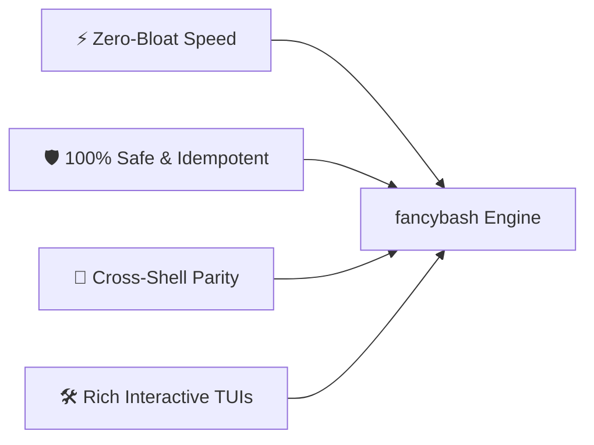

# 🗺️ fancybash Project Roadmap

Welcome to the **fancybash** project roadmap! This document outlines our product vision, architectural principles, past release milestones, and planned future enhancements.

> [!NOTE]
> This roadmap represents our current strategic direction. Feature priorities may evolve based on community feedback, user proposals, and contributions.

<div align="center">

[](#)
[](#)
[](https://github.com/rihadjahanopu/fancybash/discussions)

</div>

---

## 📌 Table of Contents

- [1. Core Vision & Design Philosophy](#1-core-vision--design-philosophy)
- [2. Release Milestones & History](#2-release-milestones--history)
  - [v1.0.0 — Foundation & Core Environment](#v100--foundation--core-environment)
  - [v2.0.0 — Cross-Shell & Interactive TUI Era](#v200--cross-shell--interactive-tui-era)
  - [v2.1.0 — Todo & Notes Managers](#v210--todo--notes-managers)
  - [v2.2.0 — FFmpeg Multimedia Suite (`ffmedia`)](#v220--ffmpeg-multimedia-suite-ffmedia)
- [3. Near-Term Roadmap (v2.3 — v2.5)](#3-near-term-roadmap-v23--v25)
- [4. Mid-Term Roadmap (v3.0)](#4-mid-term-roadmap-v30)
- [5. Long-Term Vision (v4.0+)](#5-long-term-vision-v40)
- [6. How to Propose or Vote on Features](#6-how-to-propose-or-vote-on-features)

---

## 1. Core Vision & Design Philosophy

`fancybash` aims to be the ultimate, lightweight shell environment for modern software developers. All roadmap features must strictly adhere to four foundational pillars:



1. **⚡ Lightning Fast Execution**: $O(1)$ telemetry calculation for PS1. No slow subshell invocations or bloat plugins.
2. **🛡️ 100% Safe & Idempotent**: Installer never overwrites `.bashrc` or `.zshrc` without creating timestamped backups. Re-running installer is always safe.
3. **🔄 Universal Cross-Shell Parity**: Equal experience across Bash, Zsh, Fish, and PowerShell 7+.
4. **🛠️ Rich TUI Experience**: Leverage modern CLI utilities (`gum`, `fzf`, `bat`, `glow`, `ffmpeg`) with multi-tier graceful fallbacks.

---

## 2. Release Milestones & History

### v1.0.0 — Foundation & Core Environment
* ✅ Production-ready single-file Bash environment (`config.sh`).
* ✅ Developer shortcuts for Git, Node.js, Bun, NPM, and navigation.
* ✅ Non-destructive idempotent installer (`install.sh`) with automatic `.bashrc` backup.

### v2.0.0 — Cross-Shell & Interactive TUI Era
* ✅ Multi-shell expansion: Added native support for **Zsh** (`config.zsh`), **Fish** (`config.fish`), and **PowerShell** (`config.ps1`).
* ✅ Dynamic rainbow prompt with Git status indicators, node/bun runtime badges, and execution timers.
* ✅ Interactive Docker TUI manager (`dman`, `dps`, sandbox containers).
* ✅ Landing website launched at [fancybash.netlify.app](https://fancybash.netlify.app).

### v2.1.0 — Todo & Notes Managers
* ✅ Interactive 3-tier task manager (`todo`) with range validation and portable BSD/GNU `sed` support.
* ✅ Plain-text interactive notes manager (`notes`) with multi-tier viewer pipeline (`glow` → `bat` → `cat`) and cross-platform clipboard support.
* ✅ Automatic dependency detection across system package managers (`apt`, `pacman`, `dnf`, `brew`).

### v2.2.0 — FFmpeg Multimedia Suite (`ffmedia`)
* ✅ Interactive 24-in-1 FFmpeg media suite (`ffmedia`, `ffstudio`, `fftool`).
* ✅ Video compression, audio extraction, GIF generator, screen recording, and EXIF metadata stripper.
* ✅ Tiered interactive selection interface (`gum` → `fzf` → fallback prompt).

---

## 3. Near-Term Roadmap (v2.3 — v2.5)

| Feature / Module | Status | Target Version | Description |
| :--- | :---: | :---: | :--- |
| **🤖 AI CLI Assistant (`fancy_ai`)** | 🏗️ In Planning | `v2.3.0` | Light local AI CLI command helper integrating with Ollama or local LLM APIs to suggest terminal commands without leaving the shell. |
| **📊 System Diagnostics TUI (`sysmon`)** | 🏗️ In Development | `v2.3.0` | Single-command TUI dashboard for CPU/RAM usage, top processes, disk IO, and listening ports using native system tools. |
| **🎨 Theme Customization Engine (`fancy_theme`)** | 📅 Scheduled | `v2.4.0` | Interactive prompt theme switcher (Dracula, Nord, Catppuccin, Tokyo Night, Cyberpunk) with live preview. |
| **⚡ 1:1 Parity for Fish & PowerShell** | 📅 Scheduled | `v2.4.0` | Port all interactive TUI utilities (`todo`, `notes`, `ffmedia`) natively to Fish and PowerShell scripts. |
| **🔍 Interactive Git Branch TUI (`gbr`)** | 📅 Scheduled | `v2.5.0` | Enhanced `fzf` + `gum` visual Git branch manager for interactive checkout, fuzzy search, stash inspection, and branch cleanup. |

---

## 4. Mid-Term Roadmap (v3.0)

```
fancybash v3.0 Architecture
├── Modular Plugin Manager (fancybash plugin add/remove)
├── Encrypted Dotfile Cloud Sync (SSH / GitHub Gist)
├── Interactive TUI Wizard (fancybash setup)
└── Native WSL2 & macOS Custom Integrations
```

* **🔌 Lightweight Plugin Architecture**: Allow users to selectively enable/disable modules (e.g., Docker suite, multimedia suite, package manager shortcuts) to minimize environment footprint.
* **☁️ Cloud & Remote Dotfile Sync**: Securely sync user customizations across multiple developer machines using encrypted GitHub Gist or SSH remote storage.
* **🧙 Interactive Setup Wizard (`fancybash setup`)**: TUI wizard to guide users through selecting preferred fonts, color schemes, active aliases, and dependency installations.
* **🖥️ Native IDE Extensions**: Enhanced integration presets for VS Code, Zed Editor, and Neovim terminal sessions.

---

## 5. Long-Term Vision (v4.0+)

* **🏢 Enterprise Shell Distribution Profiles**: Standardized shell profiles for software teams and server clusters with enforced security policies and audited command aliases.
* **⏱️ Shell Benchmarking Suite (`fancybench`)**: Automated tool to measure shell startup latency, prompt render times, and memory consumption down to sub-millisecond precision.
* **🌐 Universal Shell Installer Standard**: One-command cross-platform installer capable of bootstrapping complete developer environments across Linux, macOS, WSL, Alpine containers, and BSD systems.

---

## 6. How to Propose or Vote on Features

We encourage community participation in shaping the future of `fancybash`!

* **Vote on Proposed Features**: Visit [GitHub Discussions — Ideas](https://github.com/rihadjahanopu/fancybash/discussions/categories/ideas) to upvote ideas you'd like to see prioritized.
* **Propose New Features**: Open a discussion thread or submit a feature request issue using our issue template.
* **Implement a Roadmap Item**: Check open issues tagged [`roadmap`](https://github.com/rihadjahanopu/fancybash/issues?q=is%3Aissue+is%3Aopen+label%3Aroadmap) or [`help wanted`](https://github.com/rihadjahanopu/fancybash/issues?q=is%3Aissue+is%3Aopen+label%3A%22help+wanted%22) and submit a Pull Request!

<br>

<div align="center">

**Have a great feature idea for fancybash?**  
[Start a Discussion on GitHub](https://github.com/rihadjahanopu/fancybash/discussions) 🚀

</div>
