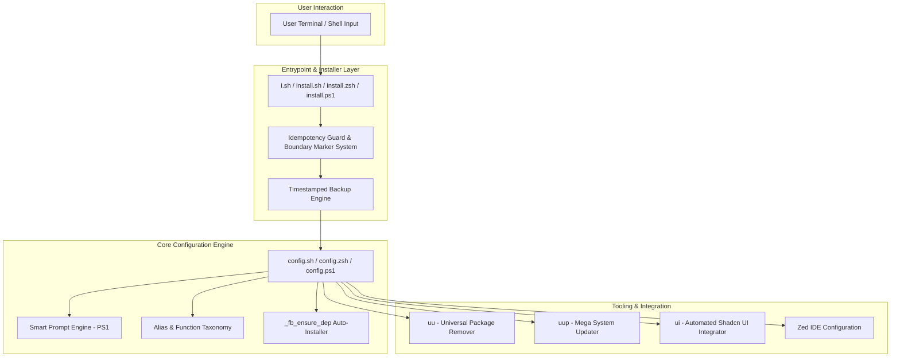
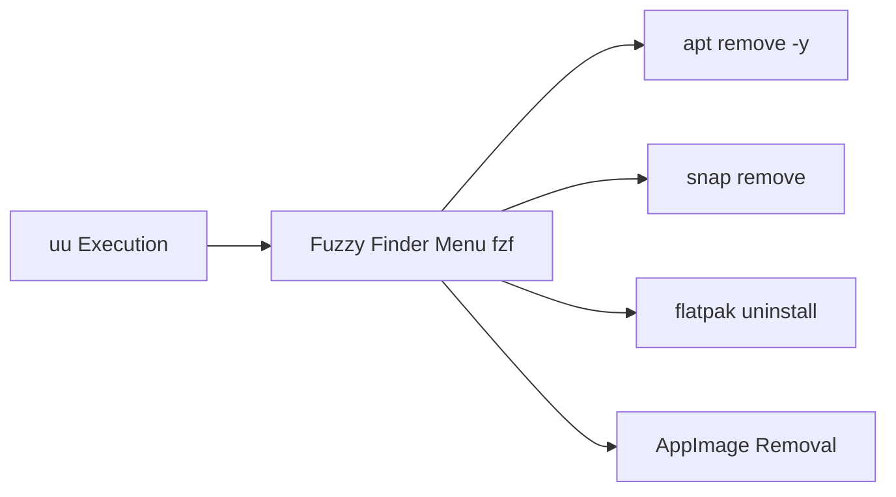

# 📖 fancybash Official Technical Wiki

<div align="center">

```
          ███████╗ █████╗ ███╗   ██╗ ██████╗██╗   ██╗██████╗  █████╗ ███████╗██╗  ██╗
          ██╔════╝██╔══██╗████╗  ██║██╔════╝╚██╗ ██╔╝██╔══██╗██╔══██╗██╔════╝██║  ██║
          █████╗  ███████║██╔██╗ ██║██║      ╚████╔╝ ██████╔╝███████║███████╗███████║
          ██╔══╝  ██╔══██║██║╚██╗██║██║       ╚██╔╝  ██╔══██╗██╔══██║╚════██║██╔══██║
          ██║     ██║  ██║██║ ╚████║╚██████╗   ██║   ██████╔╝██║  ██║███████║██║  ██║
          ╚═╝     ╚═╝  ╚═╝╚═╝  ╚═══╝ ╚═════╝   ╚═╝   ╚═════╝ ╚═╝  ╚═╝╚══════╝╚═╝  ╚═╝
```

### ⚡ Comprehensive Developer & Technical Guide for fancybash 2.0

*Enterprise Architecture • Shell Optimization • Production Workflows • Complete Command API*

<br>

[](https://opensource.org/licenses/MIT)
[](https://www.gnu.org/software/bash/)
[](#)
[](#)
[](https://fancybash.netlify.app)

</div>

---

## 📌 Table of Contents

- [1. Wiki Overview \& Vision](#1-wiki-overview--vision)
- [2. Architectural Design \& Core Mechanics](#2-architectural-design--core-mechanics)
  - [2.1 High-Level Architecture](#21-high-level-architecture)
  - [2.2 Execution Order \& Lifecycle](#22-execution-order--lifecycle)
  - [2.3 Boundary Marker Safety Engine](#23-boundary-marker-safety-engine)
- [3. Installation \& Environment Setup](#3-installation--environment-setup)
  - [3.1 Prerequisites](#31-prerequisites)
  - [3.2 Universal Installer (Automated)](#32-universal-installer-automated)
  - [3.3 Shell-Specific Install Methods](#33-shell-specific-install-methods)
  - [3.4 Manual Setup (Clone \& Source)](#34-manual-setup-clone--source)
  - [3.5 Clean Uninstallation Protocol](#35-clean-uninstallation-protocol)
- [4. Smart Prompt Engine](#4-smart-prompt-engine)
  - [4.1 Two-Line Layout Structure](#41-two-line-layout-structure)
  - [4.2 Dynamic Emoji Context Engine](#42-dynamic-emoji-context-engine)
  - [4.3 Real-time System Metrics \& Telemetry](#43-real-time-system-metrics--telemetry)
  - [4.4 Command Execution Timer](#44-command-execution-timer)
- [5. Complete Command \& Alias API Manual](#5-complete-command--alias-api-manual)
  - [5.1 Interactive Workflows (`ii`, `ui`, `next`)](#51-interactive-workflows-ii-ui-next)
  - [5.2 Interactive Package Manager (`uu`)](#52-interactive-package-manager-uu)
  - [5.3 Mega System Updater (`uup`)](#53-mega-system-updater-uup)
  - [5.4 Navigation \& Directory Movement](#54-navigation--directory-movement)
  - [5.5 Git Version Control Matrix](#55-git-version-control-matrix)
  - [5.6 Node.js, NPM, Yarn \& pnpm Workflows](#56-nodejs-npm-yarn--pnpm-workflows)
  - [5.7 Bun First-Class Ecosystem](#57-bun-first-class-ecosystem)
  - [5.8 Docker \& Container Management](#58-docker--container-management)
  - [5.9 Database Tools (PostgreSQL \& Prisma)](#59-database-tools-postgresql--prisma)
  - [5.10 Security, Networking \& Utility Suite](#510-security-networking--utility-suite)
- [6. Multi-Platform \& Shell Compatibility](#6-multi-platform--shell-compatibility)
  - [6.1 Linux Distributions Support](#61-linux-distributions-support)
  - [6.2 macOS Terminal Integration](#62-macos-terminal-integration)
  - [6.3 Windows PowerShell 7+ Strategy](#63-windows-powershell-7-strategy)
  - [6.4 Zsh Engine Adaptation](#64-zsh-engine-adaptation)
- [7. Modern Editor \& Terminal Integration](#7-modern-editor--terminal-integration)
  - [7.1 Zed IDE Setup](#71-zed-ide-setup)
  - [7.2 VS Code Terminal Profile](#72-vs-code-terminal-profile)
  - [7.3 Font Setup \& Icon Rendering](#73-font-setup--icon-rendering)
- [8. Configuration, Customization \& Overrides](#8-configuration-customization--overrides)
  - [8.1 Extending Without Modifying Core](#81-extending-without-modifying-core)
  - [8.2 Environment Variables Reference](#82-environment-variables-reference)
- [9. Troubleshooting, Diagnostics \& FAQ](#9-troubleshooting-diagnostics--faq)
- [10. Developer Guide \& Contribution Protocol](#10-developer-guide--contribution-protocol)

---

## 1. Wiki Overview & Vision

**fancybash** is an enterprise-grade, zero-bloat, opinionated shell configuration framework engineered specifically for modern full-stack web developers, DevOps engineers, and system administrators. 

Unlike heavy framework managers (e.g., Oh My Zsh, Prezto, or Fisher) that incur measurable shell startup latencies due to nested plugin autoloaders, **fancybash** operates as a **single-file, zero-external-dependency configuration system**. It delivers lightning-fast shell startup times (<10ms Overhead) while providing over 200+ curated aliases, smart interactive workflows, context-aware prompt telemetry, and universal package updating.

> [!NOTE]
> **Core Technical Promise**: One file. One install. Zero dependencies. Non-destructive integration via atomic backup and boundary-marked sourcing.

---

## 2. Architectural Design & Core Mechanics

### 2.1 High-Level Architecture

The fancybash system consists of four primary decoupled layers:



### 2.2 Execution Order & Lifecycle

When a shell session starts (e.g., loading `~/.bashrc` or `~/.zshrc`), fancybash executes in the following sequence:

1. **Unalias Guard**: Clears potential pre-existing function or alias collisions to ensure idempotent loading.
2. **Color Token Initialization**: Sets up 16-color ANSI sequence definitions and random color arrays.
3. **Helper Function Binding**: Registers core helpers (`_fb_ensure_dep`, `parse_git_branch`, `cpu_temp`, `sys_info`, `folder_size`, `get_duration`).
4. **DEBUG Trap Registration**: Registers the subshell execution timer via `trap 'timer_start' DEBUG` to calculate command runtimes dynamically.
5. **Prompt Engine Construction**: Assembles `$PS1` dynamically using ANSI escapes and prompt functions.
6. **Workflow & Utility Definition**: Registers interactive tools (`ii`, `ui`, `next`, `gen`, `ex`, `uu`, `uup`, `ports`, `myip`).
7. **Development Ecosystem Aliases**: Loads categorized aliases for Git, Bun, Node, NPM, Docker, PostgreSQL, and Prisma.

### 2.3 Boundary Marker Safety Engine

fancybash guarantees non-destructive installation and uninstallation by encapsulating all injected code within cryptographic boundary markers:

```bash
# >>> fancy-bashrc >>>
# Environment & Aliases managed by fancybash 2.0
[... core config content ...]
# <<< fancy-bashrc <<<
```

The uninstaller (`u.sh`) uses `sed` to slice out lines exclusively within these delimiters, maintaining total isolation from user-defined `.bashrc` or `.zshrc` customizations.

---

## 3. Installation & Environment Setup

### 3.1 Prerequisites

- **Shell**: Bash 4.0+, Zsh 5.0+, or PowerShell 7+
- **Network & Utils**: `curl`, `git`
- **Optional (Auto-installed if missing on Linux)**: `fzf`, `bat`/`batcat`, `eza`/`exa`, `fd`/`fdfind`, `lm-sensors`, `openssl`

### 3.2 Universal Installer (Automated)

The universal entry point installer `i.sh` auto-detects your operating system (Linux, macOS) and user shell (`bash`, `zsh`) to execute the correct installer:

```bash
curl -fsSL https://raw.githubusercontent.com/rihadjahanopu/fancybash/refs/heads/main/i.sh | bash
```

### 3.3 Shell-Specific Install Methods

<details>
<summary><strong>Bash (`~/.bashrc`) Direct Installation</strong></summary>

```bash
bash <(curl -fsSL https://raw.githubusercontent.com/rihadjahanopu/fancybash/refs/heads/main/install.sh)
```
</details>

<details>
<summary><strong>Zsh (`~/.zshrc`) Direct Installation</strong></summary>

```zsh
zsh <(curl -fsSL https://raw.githubusercontent.com/rihadjahanopu/fancybash/refs/heads/main/install.zsh)
```
</details>

<details>
<summary><strong>PowerShell (`$PROFILE`) Direct Installation</strong></summary>

```powershell
Set-ExecutionPolicy Bypass -Scope Process -Force; iex (irm https://raw.githubusercontent.com/rihadjahanopu/fancybash/refs/heads/main/install.ps1)
```
</details>

### 3.4 Manual Setup (Clone & Source)

If you prefer inspecting source files before installation:

```bash
# 1. Clone repository
git clone https://github.com/rihadjahanopu/fancybash.git
cd fancybash

# 2. Append configuration to target shellrc
# For Bash:
cat config.sh >> ~/.bashrc
source ~/.bashrc

# For Zsh:
cat config.zsh >> ~/.zshrc
source ~/.zshrc
```

### 3.5 Clean Uninstallation Protocol

The universal uninstaller dynamically removes fancybash blocks without touching your custom aliases or environment variables:

```bash
# Universal automated uninstall
curl -fsSL https://raw.githubusercontent.com/rihadjahanopu/fancybash/refs/heads/main/u.sh | bash
```

> [!IMPORTANT]
> **Manual Removal Regex**:
> - **Linux (GNU sed)**: `sed -i '/# >>> fancy-bashrc >>>/,/# <<< fancy-bashrc <<</d' ~/.bashrc`
> - **macOS (BSD sed)**: `sed -i '' '/# >>> fancy-bashrc >>>/,/# <<< fancy-bashrc <<</d' ~/.bashrc`

---

## 4. Smart Prompt Engine

### 4.1 Two-Line Layout Structure

The fancybash prompt is engineered to provide maximum operational clarity without cluttering your workspace terminal lines:

```
🌐 web-project 📂 42M [🌿 main ❗] 🌡️ 48°C 💽 120G free ⚖️ 0.45 ⏱️ 3s
🟢 v20.11.0 │ 📦 10.2.4 │ 🥐 1.1.0 │ 🐧 6.8.0 │ 📅 Aug 13 │ 🧠 4120M/16000M │ 🔋98%
❯❯❯ 
```

### 4.2 Dynamic Emoji Context Engine

The prompt evaluates directory basename metadata to present contextual icons automatically:

| Path Pattern / Keywords | Visual Emoji | Context Trigger |
| :--- | :---: | :--- |
| `*web*`, `*frontend*` | 🌐 | Web application projects |
| `*node*`, `*express*`, `*nest*` | 🟢 | Node.js backend projects |
| `*bun*`, `*elysia*` | 🥐 | Bun runtime projects |
| `*py*`, `*django*`, `*fastapi*` | 🐍 | Python development environments |
| `*proj*`, `*work*` | 💻 | Generic software projects |
| *Default / Other* | 🔥 ⚡️ 🚀 💫 🌈 🌀 ✨ 🧠 | Randomized active workspace icon |

### 4.3 Real-time System Metrics & Telemetry

- **CPU Temperature Guard (`cpu_temp`)**: Inspects `/sys/class/thermal/thermal_zone0/temp` or `lm-sensors`. Color switches automatically based on load:
  - 🟢 `< 55°C`: Normal Operating Temp
  - 🟡 `55°C - 70°C`: Elevated Load
  - 🔴 `> 70°C`: Thermal Alert Threshold
- **Git State Telemetry (`parse_git_branch`)**: Extracts current branch name or short commit hash (`➦ hash`), appending a visual dirty state indicator (`❗`) if uncommitted working tree modifications exist.
- **Memory Telemetry (`sys_info`)**: Parses `/proc/meminfo` or `free -h` to present real-time active vs total RAM metrics (`🧠 4.2G/16G`).

### 4.4 Command Execution Timer

Utilizes Bash internal `$SECONDS` combined with a `DEBUG` trap to track command execution durations. Durations exceeding 1 second are highlighted on the status line (`⏱️ 4s`).

---

## 5. Complete Command & Alias API Manual

### 5.1 Interactive Workflows (`ii`, `ui`, `next`)

#### `ii` — Universal Project Initializer
Interactively detects available package managers (`bun`, `npm`, `pnpm`, `yarn`), initializes the project config, and auto-generates a standardized `.gitignore` with `node_modules/`.

#### `ui` — Automated Shadcn UI & Vite Integrator
Inspects project structure (`tsconfig.app.json`, `next.config.js`, `package.json`), automatically patches `@/*` path aliases in `tsconfig`/`jsconfig`, injects Tailwind CSS plugins into `vite.config.ts`, and executes Shadcn initialization.

#### `next` — One-Touch Next.js Launcher
Interactively prompts for package manager selection (`Bun` or `NPM`) and fires `create-next-app@latest .` instantly.

---

### 5.2 Interactive Package Manager (`uu`)

`uu` is an interactive fuzzy application uninstaller powered by `fzf`. It searches installed packages across all package managers on Linux:



---

### 5.3 Mega System Updater (`uup`)

`uup` runs multi-system updates in a single command with unified success reporting:

1. **OS Package Manager**: `apt-get update && upgrade`, `dnf upgrade`, `pacman -Syu`, `zypper update`, `apk upgrade`, or `brew update && upgrade`.
2. **Snap Packages**: `snap refresh`
3. **Flatpak Applications**: `flatpak update -y`
4. **Bun Runtime**: `bun upgrade`
5. **Node & NPM Core**: `npm install -g npm@latest`

---

### 5.4 Navigation & Directory Movement

| Command | Action / Equivalent Command |
| :--- | :--- |
| `..` | `cd ..` |
| `...` | `cd ../..` |
| `....` | `cd ../../..` |
| `.....` | `cd ../../../..` |
| `.2` / `.3` / `.4` | Quick relative traversal upwards N levels |
| `cls` | Clear screen (`clear`) |
| `h` | Output command history |
| `path` | Output `$PATH` formatted line-by-line |
| `ports` | Show active listening network ports (`netstat` / `ss` / `lsof`) |
| `myip` | Display local network IP and public WAN IP (`curl ipinfo.io`) |

---

### 5.5 Git Version Control Matrix

| Alias | Full Command Execution | Purpose |
| :--- | :--- | :--- |
| `gs` | `git status -sb` | Short, clean status with branch info |
| `ga` | `git add .` | Stage all working directory changes |
| `gaa` | `git add -A` | Stage all changes including deletions |
| `gc` | `git commit -m` | Commit staged changes with message |
| `gca` | `git commit -am` | Stage tracked files & commit |
| `gcm` | `git commit -m "update"` | Rapid standard commit |
| `gp` | `git push` | Push current branch to remote |
| `gpf` | `git push --force-with-lease` | Safe force push |
| `gpl` | `git pull --rebase` | Rebase local commits onto remote |
| `gl` | `git log --oneline --graph --decorate -n 15` | Visual git graph log |
| `gb` | `git branch -a` | List local and remote branches |
| `gsw` | `git switch` | Switch active branch |
| `grh` | `git reset --hard HEAD` | Hard reset local changes |
| `gst` | `git stash` | Stash modified files |
| `gsh` | `git stash pop` | Pop latest stashed modifications |

---

### 5.6 Node.js, NPM, Yarn & pnpm Workflows

| Alias | Executed Action | Domain |
| :--- | :--- | :--- |
| `ni` | `npm install` | Package Installation |
| `nid` | `npm install --save-dev` | Dev Dependency Install |
| `nig` | `npm install -g` | Global Install |
| `ns` | `npm start` | Script Execution |
| `nb` | `npm run build` | Build Execution |
| `nd` | `npm run dev` | Dev Server Execution |
| `nt` | `npm test` | Test Suite Execution |
| `nu` | `npm uninstall` | Package Removal |
| `ncu` | `npx npm-check-updates -u` | Dependency Upgrade Suite |
| `pi` | `pnpm install` | PNPM Package Install |
| `pd` | `pnpm dev` | PNPM Dev Server |
| `pb` | `pnpm build` | PNPM Production Build |
| `yi` | `yarn install` | Yarn Package Install |
| `yd` | `yarn dev` | Yarn Dev Server |

---

### 5.7 Bun First-Class Ecosystem

| Alias | Command Binding | Operational Description |
| :--- | :--- | :--- |
| `b` | `bun` | Fast JavaScript/TypeScript runtime |
| `bi` | `bun install` | Lightning package installer |
| `bid` | `bun add -d` | Add development dependency |
| `br` | `bun run` | Execute script target |
| `brd` | `bun run dev` | Launch fast development server |
| `brb` | `bun run build` | Execute production bundle |
| `brs` | `bun run start` | Launch production server |
| `bx` | `bunx` | Execute package binary |
| `bt` | `bun test` | Execute native Bun runner |

---

### 5.8 Docker & Container Management

| Alias | Command | Purpose |
| :--- | :--- | :--- |
| `d` | `docker` | Container daemon binary |
| `dc` | `docker compose` | Compose multi-container orchestrator |
| `dcu` | `docker compose up -d` | Detached container cluster launch |
| `dcd` | `docker compose down` | Terminate & cleanup compose stack |
| `dps` | `docker ps --format "table {{.ID}}\t{{.Names}}\t{{.Status}}\t{{.Ports}}"` | Formatted container status overview |
| `di` | `docker images` | List local cached images |
| `dcl` | `docker compose logs -f` | Tail container logs live |
| `dexec` | `docker exec -it` | Interactive TTY execution in container |
| `dprune` | `docker system prune -af --volumes` | Deep container & volume cleanup |

---

### 5.9 Database Tools (PostgreSQL & Prisma)

#### PostgreSQL Shortcuts
- `pgstart`: Starts local PostgreSQL service (`sudo systemctl start postgresql` / `brew services start postgresql`)
- `pgstop`: Stops local PostgreSQL service
- `pgdb`: Launches interactive `psql` shell
- `pguser`: Switches shell user to `postgres`

#### Prisma ORM Suite
- `px`: `npx prisma`
- `pxg`: `npx prisma generate` (Regenerates Client bindings)
- `pxd`: `npx prisma db push` (Pushes schema state directly)
- `pxm`: `npx prisma migrate dev` (Executes SQL migration script)
- `pxs`: `npx prisma studio` (Launches visual database browser)

---

### 5.10 Security, Networking & Utility Suite

#### Secret Key Generator (`gen`)
Generates cryptographically secure random keys via OpenSSL:
```bash
gen 32    # Generates a 32-character hexadecimal key
gen 64    # Generates a 64-character base64 secret string
```

#### Universal Archive Extractor (`ex`)
Extracts any compressed file format automatically without needing syntax flags:
```bash
ex archive.tar.gz
ex file.zip
ex payload.7z
ex package.rar
```

---

## 6. Multi-Platform & Shell Compatibility

### 6.1 Linux Distributions Support

fancybash contains native package detection logic (`_fb_ensure_dep`) for all major Linux distributions:
- **Debian / Ubuntu / Linux Mint / Deepin**: `apt-get`
- **Arch Linux / Manjaro / EndeavourOS**: `pacman`
- **Fedora / RHEL / CentOS / AlmaLinux**: `dnf`
- **openSUSE**: `zypper`
- **Alpine Linux**: `apk`

### 6.2 macOS Terminal Integration

Fully compatible with macOS default Zsh & Bash terminals. Integrates with `homebrew` for dependency auto-installation (`brew install`).

### 6.3 Windows PowerShell 7+ Strategy

The `config.ps1` and `install.ps1` suite provides feature parity for Windows Terminal users running PowerShell 7+.

### 6.4 Zsh Engine Adaptation

The `config.zsh` module adapts Bash prompt strings (`PS1`) and alias syntax to Zsh options (`PROMPT_SUBST`, `autoload -U colors`).

---

## 7. Modern Editor & Terminal Integration

### 7.1 Zed IDE Setup

fancybash provides pre-configured terminal integration settings for the **Zed Editor** (`zed/settings.json`):

```json
{
  "terminal": {
    "alternate_scroll": "off",
    "blinking": "terminal_controlled",
    "copy_on_select": false,
    "font_family": "FiraCode Nerd Font",
    "font_size": 14,
    "line_height": "comfortable",
    "option_as_meta": true
  }
}
```

### 7.2 VS Code Terminal Profile

To set fancybash as your default integrated terminal profile in VS Code:

```json
{
  "terminal.integrated.defaultProfile.linux": "bash",
  "terminal.integrated.fontFamily": "'FiraCode Nerd Font', 'JetBrains Mono', monospace",
  "terminal.integrated.cursorBlinking": true
}
```

### 7.3 Font Setup & Icon Rendering

To ensure all emoji indicators and git branch symbols render without broken character glyphs, install a **Nerd Font**:

1. Recommended Fonts: **FiraCode Nerd Font**, **JetBrains Mono Nerd Font**, or **Hack Nerd Font**.
2. Set terminal emulator font to your chosen Nerd Font family.

---

## 8. Configuration, Customization & Overrides

### 8.1 Extending Without Modifying Core

To add your own custom aliases or override default fancybash settings safely, add them to your `~/.bashrc` **below** the fancybash boundary block:

```bash
# >>> fancy-bashrc >>>
# ... core fancybash config ...
# <<< fancy-bashrc <<<

# ======================================================
# 🛠️ MY CUSTOM USER OVERRIDES
# ======================================================
alias myproject="cd ~/Developer/my-custom-project && code ."
export EDITOR="nano"
```

---

## 9. Troubleshooting, Diagnostics & FAQ

<details>
<summary><strong>Q: Emojis or symbols appear as missing boxes () or broken glyphs.</strong></summary>

**Solution**: Install a Nerd Font (e.g. FiraCode Nerd Font) and select it as the active font in your terminal emulator settings.
</details>

<details>
<summary><strong>Q: `uu` gives error "fzf command not found".</strong></summary>

**Solution**: Run `uu` once; `_fb_ensure_dep` will auto-install `fzf` using your distro package manager. Alternatively, install manually: `sudo apt install fzf` or `brew install fzf`.
</details>

<details>
<summary><strong>Q: How do I temporary disable fancybash for a single session?</strong></summary>

**Solution**: Launch bash with standard defaults bypassing config: `bash --norc`.
</details>

---

## 10. Developer Guide & Contribution Protocol

We welcome community contributions! Please adhere to our development standards:

1. **POSIX & ShellCheck Compliance**: Run `shellcheck` on all shell script edits before submitting pull requests.
2. **Zero External Runtime Overhead**: Do not add heavy external script dependencies.
3. **Idempotency Verification**: Ensure every function check uses `command -v <tool> &>/dev/null`.
4. **Safety Verification**: Ensure installers always generate timestamped backup files before modifying `~/.bashrc` or `~/.zshrc`.

---

<div align="center">

**Maintained with ❤️ by Rihad Jahan Opu**

[Website](https://fancybash.netlify.app) • [GitHub Repository](https://github.com/rihadjahanopu/fancybash) • [Report Issue](https://github.com/rihadjahanopu/fancybash/issues)

</div>
